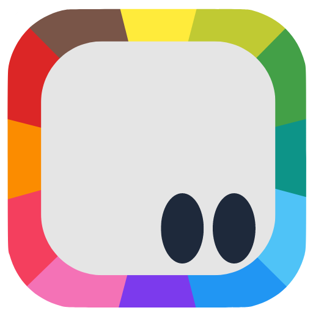
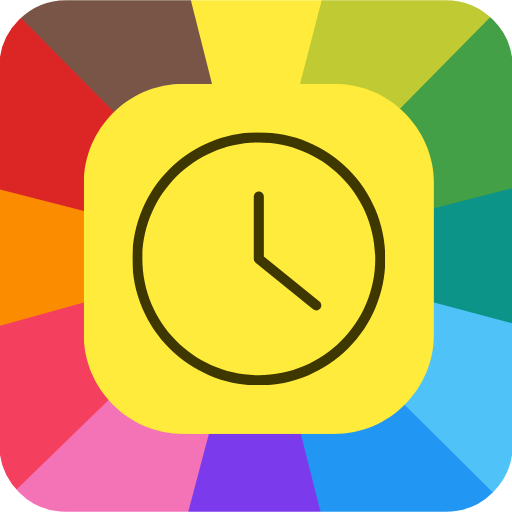
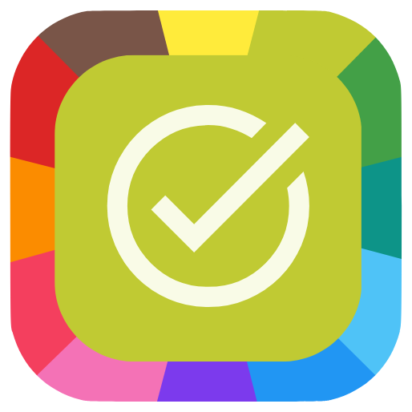

# Agustín Minetto

### Mobile and Full Stack Developer | Chemical Engineer | Entrepreneur | Team Leader

I am a Mobile and Full Stack Developer with a background in Chemical Engineering, bringing over 15 years of experience in process optimization. After transitioning into the tech industry, I have gained more than 3 years of international experience as a developer. I later founded FollowApps, a suite of mobile applications designed to streamline people's daily routines. My expertise includes Kotlin, React, React Native, TypeScript, Node.js, and a variety of web and mobile development technologies. I have held leadership roles and have a strong foundation in agile methodologies and project management.

## Open to work 💻👨‍💻

I’m currently looking for a position as `Mobile` (Kotlin / React Native) or `Full Stack` (React / Node.js) Developer.

### This is my stack

  
  
  
  
	<!--  -->
	
	
	
	
	
	
	<!--  -->
  
	
  
  
  
<!--  -->
  
  
  
  
  
	<!--  -->
  
  
  
  
  
	<!--  -->
  
  
  
  
  
	<!--  -->
  
  
  
  

### Feel free to contact me! 🗣️🇦🇷🇬🇧🇮🇪🇫🇷🇧🇷

  

Yo can also request my phone number!

<!-- https://medium.com/@regondaakhil/maximizing-your-github-profile-tips-for-writing-a-stellar-readme-9c6bb6179f49 -->
<!-- https://github.com/simple-icons/simple-icons/blob/master/slugs.md -->

## &nbsp;&nbsp; FollowApps

FollowApps is a powerful ecosystem of 12 interconnected applications, designed to simplify daily management tasks for individuals and micro-businesses. MyTime and MyTasks are already published on Google Play, MyLogs will soon join them.

FollowApps offers a unique solution for those who are not very tech-savvy, lack resources for more sophisticated management tools, or manage micro-businesses. The suite is designed to be easy to use and affordable, meeting the specific needs of these users.

I am in charge of the entire process, from programming in Kotlin to UX/UI design, project management, and customer relations. The progress made so far demonstrates the broad set of skills required and successfully applied in this project.

<table>
  <tr>
    <td align="left">
      &nbsp;&nbsp;&nbsp;MyTime  
    </td>
    <td align="left">
      &nbsp;&nbsp;&nbsp;MyTasks  
    </td>
  </tr>
  <tr>
    <td>
      <code>MyTime</code> is a personal time management assistant designed to help users understand how their time is spent. It provides insights into daily and weekly activities, empowering informed decisions to optimize time usage. By identifying areas for improvement, <code>MyTime</code> aims to make every moment count. Integrating seamlessly with other <code>FollowApps</code>, it creates a comprehensive ecosystem for managing day-to-day activities.   
			<!-- 			
			   -->
					
			  
			 &nbsp;&nbsp;
      <!--  -->
    </td>
    <td>
      <code>MyTasks</code> is a simple yet powerful task management app designed to reclaim valuable free time. It effortlessly tracks tasks and deadlines, ensuring minimal time spent on them and more focus on what truly matters. Seamlessly integrating with other apps in the <code>FollowApps</code> suite, <code>MyTasks</code> provides a comprehensive ecosystem for managing daily activities efficiently.   
			<!-- 
			   -->
			
			  
       &nbsp;&nbsp;
      <!--  -->
    </td>
  </tr>
</table>

<!-- ##  GitHub Stats

 -->

<!-- https://github.com/anuraghazra/github-readme-stats/blob/master/themes/README.md -->
